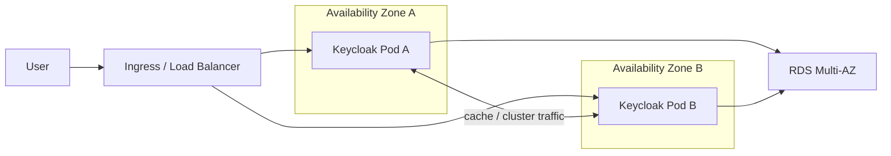

# Single-Cluster HA Architecture

## Reading the diagram

- The application tier is duplicated with at least 2 Pods.
- Pods should not be concentrated on one node or one AZ.
- The database tier also needs HA; otherwise the login path still has a single point of failure.
- This is a single-cluster HA sample, not a multi-cluster or multi-region architecture.
